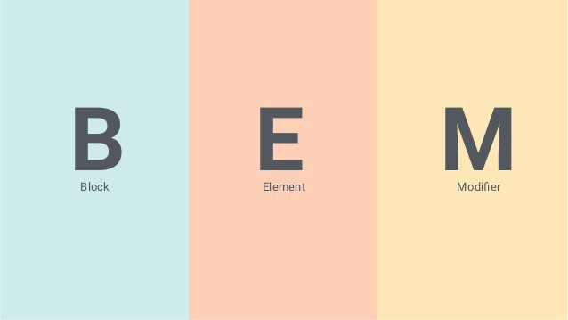

#  Hey, Thank you for taking some time to review my CODE. 👋

##  Please do read this ReadMe before the evaluation as I explain the reasons why I did what I did 😇

[](https://sonarcloud.io/dashboard?id=qawsedstation_fe-test-2) [](https://app.codeship.com/projects/389751)

### Dependencies

`$ npm install`

### Run the project!

`$ npm start`

### Test

`$ npm test`

### Check the code quality 

`$ npm lint`

# What I changed to the project before I start coding 

1. I cloned this repo, and I enhanced it by adding support for es6 (It could be Typescript be this would need little more time to configure) and reconfigure babel add additional loaders on webpack e.t.c 
2. I fixed a couple of vulnerabilities found by running npm audit fix
3. I moved the dependencies to dev dependencies as those are needed only on dev/build time 
4. I added eslint, and I chose Airbnb style guide as my preference which was necessary to enforce code quality
6. There are two approaches out there. The first one is to keep the test folder outside of the src folder. The second, which I prefer is that the unit test should leave together under the same module with the code. I removed the existing test folder, and I added the tests within the folder of each module as is easy to identify where the test for this code is.  In case we want to move this module outside of the project (for example build third party lib) we take the tests that are related with this module.  Also, if we want to remove the code by deleting the folder is eliminating the relevant unit tests as well, so there is nothing left behind. 
So is a good practice, in my opinion, code and test to live under the same module.
7. I have done some reconfiguration of babel and webpack jest and eslint files. 


# No Framework or Libraries and Why I took this approach 

I choose not to download any react.js, vue.js, angular.js or Angular 2+ frameworks and libraries even if **I worked with all of them in the past**. The reason is that it would be far too easy to implement the task, and because there are only one or two ways to use these frameworks and libraries will not help the testing process, for you to see how I'm thinking about when I develop. 

Although If I were up to develop into a production environment, I would consider using one of those because of the flexibility you can get like RAPID Development, Community support, Component-Based Architecture e.t.c


# Why there is no "state management" to the project 


It might look a little odd initially as someone will expect to see an internal state inside the App module. 

Something like that(And this would reflect on the view immediately):
 ```javascript
numberItem = [{
    number: 1,
    isHighlighted: true
},{
    number: 2,
    isHighlighted: false
}];

 ```

- That would be a perfect case if we were speaking about a react app: Every change at the state would lead to an automatic call of render(), and the Virtual Dom would then get in sync with the Real Dom.

- That would be a perfect case if we were speaking about an Angular app: Every change at the variable would trigger a one or two-way binding, and the Dom will be changed automatically.

- But there is not the case here. If we want to keep in sync between an internal state and the Dom, we should then build our VIEW library that keeps in sync the Model/State and the VIEW. 

-  As was out of the scope to create our library, the only thing we could do would be to keep two sources of truth and just manually sync them. And here is the big problem. Is 100% better to use as **single source of truth** the real DOM instead of creating an additional source of truth that could potentially lead to BUGS and inconsistencies to our software

> So to summarise: Keep a state internally as the Model in an MVC or MVVM world is good, but if there is no library to keep a single source of truth is better and safer to use the Real Dom as the only single source of truth. 

# Maintainability and extensibility

# Maintainability and extensibility

- I used **KISS principle** and keep it simple as possible 
- I used the **DRY principle** by reusing code to avoid duplications (0% Duplications currently)
- I **used Constants** so I do not use **magic strings** and also If I do a change in my selectors, for example, those would change automatically everywhere even on my tests (Tests should be treated like code)
- **Separation of concerns**: I moved all the code that deals with the VIEW into another file that deals with rendering in the page and I keep all my business logic inside the App class. 

So instend of using: 
 ```javascript
document.getElementById("numbers__item").addEventListener('click', () => { 
   //Here goes the code
}));
 ```

I use it like that
 ```javascript
NumberItemView.onClickAtNumberItem((clickedNumber, isHighlighted) => {  
   //Here goes the code 
})
 ```

- I used **Airbnb Styleguide** and eslint to prevent inconsistencies and prettier especially if I had to work within a team 
- I used **variables on the CSS** for my (AAA Accessible) colour palette, so I do not repeat the colours everywhere. 
- I used the **YAGNI** principle, so I implement only the things we need for this exercise and nothing extra.
- I used the **Constructor Design Pattern** ,so the range is configurable from outside
- I used the **BEM** for my CSS as the naming convention in order if my app grows and becomes bigger to be able to maintain it without braking CSS of another module.
- I used the **LIFT** Guidelines: 
  - Locating our code is easy
  - Identify code at a glance
  - Flat structure as long as we can
  - Try to stay DRY (Don't Repeat Yourself) or T-DRY
- I used the **SOLID** principles
- I have **Documentation** ReadMe file in every module and JSDocs on top of every method including the types that helps on autocomplete
  - [App JSDOC Documenation](src/app/documentation.md)
  - [NumberHelper JSDOC Documenation](src/number-helper/documentation.md)
  - [NumberItemView JSDOC Documenation](./src/number-item-view/documentation.md)

- The code in each module is less than 100 lines
- I used SonarCube to show me potential code smells, Bugs, Duplications, Tech Debt, Vulnerabilities (zero issues found) and eslint to be inline with the Airbnb style guide

.


# Coding style

.

> I worked with a couple in the past, but now I use Airbnb style guide. I believe there is nothing to do with, which is the best one out there. Is more about what the team feels more comfortable to work with. I used elsint to enforce the usage of the style guide, and I'm also using prettier to format my code automatically.


About the semicolons comment: 
We have done numerous debates in the past about this issue, and the time spend on it does not pay-off. 
Some people are very opinionated on semicolons. So yeah we can avoid semicolons this is fine. There is no big deal with it.  By the end, the webpack will minify and uglify and remove all semicolons so that everything will become again the same. I'm not suggesting anything, other than picking a style guide that is already out there like AirBnB, Google e.t.c use it as a team in a mature way and enforce consistency and code quality. Only change rules when it is necessary the community updates the style guide continuously. 

But if we decide to go without semicolons, we should be careful with return statements. If you return something, add it on the same line as the return (same for the break, throw, continue). Never start a line with parentheses, those might be concatenated with the previous line and create different results.


# Test-Driven Development approach 

- I used TDD when I was implementing this technical test, and my priority was to make it working and fill out the requirements. I used two types of testing pure unit testing and Integration testing. For example, the number-helper Class is covered by the unit test as is a pure function and we can use it  as a black box (input/output)
The App module is covered by Integration Tests as we combine two parts together, the "View" and the "controller."

- There is a way to use BDD as well with a plugin called jest-cucumber, but I did not have the time to configure it at this point.
- I did not implement E2E testing because we did not integrate with other pages or systems like http requests e.t.c was not huge need to apply to this exercise as the integration tests covered all the scenarios and the E2E test, in this case, would do just a duplication. 
- Also, I'm conscious about the pros and cons of each part of the Testing Pyramid (see below image) Value vs Speed. The E2E tests give us more value but are more "expensive", and we cannot cover all the scenarios with those.  Then unit tests are quicker to write and run but give us less confident about the application as a whole. An Ideal project should have all of them in the correct balance.  

.


# Use of responsive design

For the responsive design, I used Flexbox and media queries. 

Also, I'm conscious about the Browser compatibility of flexBox, and I believe nowadays 98.74% coverage is relatively ok 
Before we decide what to use in a production environment though we must look on Google Analytics or Mixpanel to check about Browsers that current customers use and take a call based on data rather than make assumptions. For example, it might be that our ideal customer's persona are older people with Windows XP and IE7 

.


# Performance & Accessibility

I got Accessibility 100% score by running Lighthouse Audit.

.

I got AAA accessibility score on my colour pallet after I run my accessibility tests. 

.


# Naming conventions used

.


> For CSS I used the BEM naming convention.

In summary: I used BEM to namespace my Block Elements and create group of smaller CSS classes depending on the attributes for example 
- I use another small Class for --highlighted and another --primary and this way I can keep my modifiers separate from my block elements.

That follows the SOLID principle taken from the programming into the design here and more specific the I — Interface segregation principle.

The interface segregation principle states that the web app should not be forced to depend on classes it does not use.
Put more simply: Do not add additional styles to an existing Class.
Instead, create a new Class and let developers use multiple Classes if needed. For example, I could have --small --big and I could mix and match my Classes in a better way.

- There are cases where BEM is not needed. For example, Shadow DOM can encapsulate the CSS of one component and therefore is not necessary to use a namespace.

More details about BEM: https://levelup.gitconnected.com/css-naming-convention-bem-block-element-modifier-2ada852a14d3

## Meeting the requirements

All the requirements were covered. 

* I hope I understood them right. Here are the unit tests that work as a documentation of what cases I covered. 

.